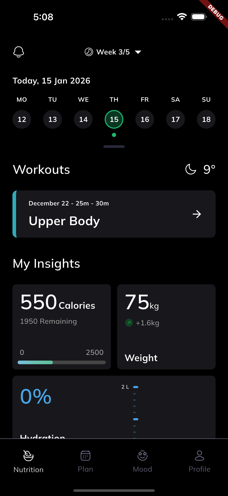
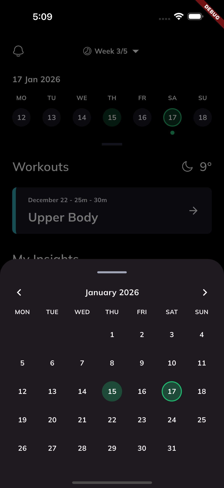
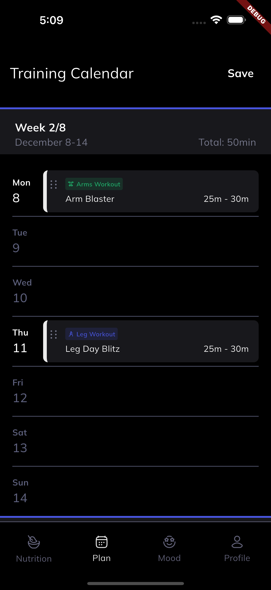
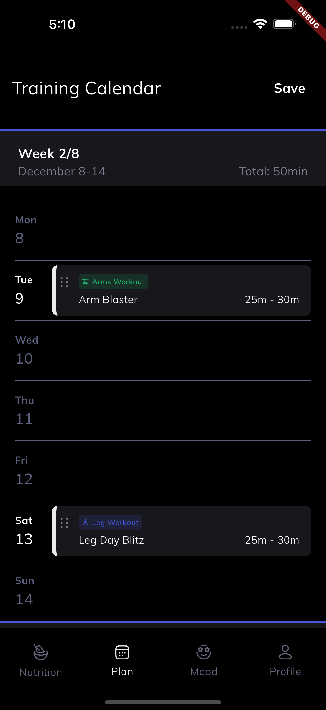
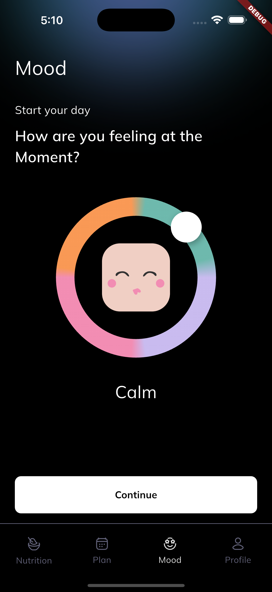
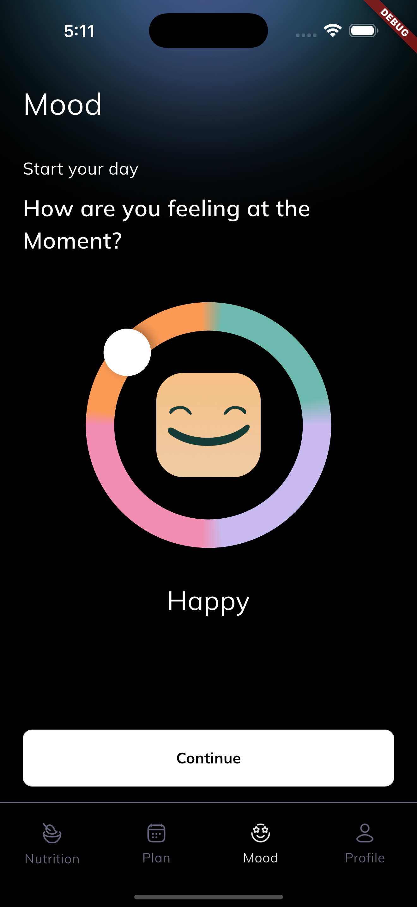

# Fitness App UI

### 1. Dependencies Used

- **intl**: _Used for date formatting_

### 2. Project Structure

```
lib/
│
├── models/                         # Data Models
│   ├── mood_data_model.dart        # Mood tracking data
│   └── workout_task_model.dart     # Workout task data
│
├── theme_data/                     # App Theming
│   ├── fonts.dart                  # Font styles
│   └── palette.dart                # Color palette
│
├── utils/                          # Utilities & Helpers
│   ├── constants.dart              # App constants
│   └── enums.dart                  # Enum definitions
│
├── views/                          # UI Screens
│   │
│   ├── mood_view/                  # Mood Tracking Screen
│   │   ├── widgets/
│   │   │   ├── button_widget.dart
│   │   │   └── mood_selector_widget.dart
│   │   └── mood_view.dart
│   │
│   ├── nutrition_view/             # Nutrition Screen
│   │   ├── widgets/
│   │   │   ├── calendar_bottom_sheet.dart
│   │   │   ├── calories_card_widget.dart
│   │   │   ├── hydration_card_widget.dart
│   │   │   ├── week_calendar_widget.dart
│   │   │   ├── weight_card_widget.dart
│   │   │   └── workout_tile_widget.dart
│   │   └── nutrition_view.dart
│   │
│   └── plan_view/                  # Workout Planning Screen
│       ├── widgets/
│       │   ├── day_row_widget.dart
│       │   ├── task_card_widget.dart
│       │   └── week_detail_widget.dart
│       └── plan_view.dart
│
├── bottom_navbar_view.dart          # Bottom Navigation
└── main.dart                        # App Entry Point
```

## Architecture Overview

#### Models (`/models`)

Contains data classes that define the structure of your app's data. No UI code here.

#### Views (`/views`)

All screen UIs organized by feature. Each screen has its own `widgets/` folder for reusable components.

#### Widgets (`/widgets`)

Contains widgets related to that specific screen.

#### Theme Data (`/theme_data`)

Centralized styling configuration including colors and fonts for consistent UI.

#### Utils (`/utils`)

Shared utilities, constants, and enums used throughout the app.

#### Navigation (`bottom_navbar_view.dart`)

Handles bottom navigation bar and screen switching.

#### Entry Point (`main.dart`)

The starting point of the application that initializes everything.

---

### 3. App Screenshots

|            Nutrition Screen            |            Nutrition Screen             |
| :------------------------------------: | :-------------------------------------: |
|  |  |

---

|            Planning Screen            |            Planning Screen             |
| :-----------------------------------: | :------------------------------------: |
|  |  |

---

|            Mood Screen            |            Mood Screen             |
| :-------------------------------: | :--------------------------------: |
|  |  |

[Watch App Demo Video](https://drive.google.com/file/d/13Wk3oedTe85Z2aYZObFg4zK9ovVgxQG0/view?usp=sharing)

[Download APK](https://drive.google.com/file/d/15eyBxefLknh1dW4U73BO9v7DpegSs9-Y/view?usp=sharing)
